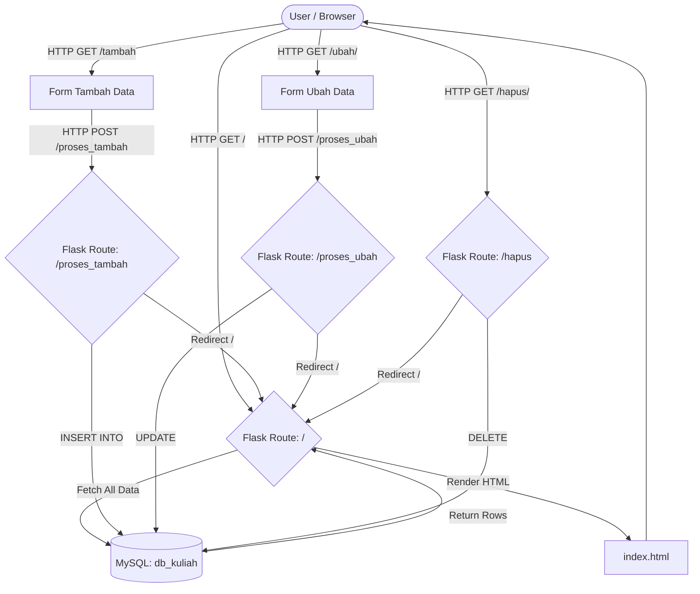

# 📚 Flask-CRUD Mahasiswa Management System


Sistem Informasi Manajemen Data Mahasiswa sederhana yang mengimplementasikan operasi **CRUD** (Create, Read, Update, Delete) menggunakan **Flask (Python)** dan **MySQL**, serta dibalut dengan antarmuka profesional dari **AdminLTE**.

---

## 🧑‍💻 Student's Log: Pemahaman Konsep
Proyek ini dikembangkan sebagai bagian dari pembelajaran mendalam terkait integrasi antara backend berbasis Python (Flask) dan basis data relasional (MySQL). Konsep utama yang dieksplorasi dalam tugas ini adalah bagaimana sebuah aplikasi web merespons *HTTP Request* (GET dan POST), memproses data melalui *Routing*, dan menyajikannya secara dinamis menggunakan *Template Engine* (Jinja2). 

Pendekatan menggunakan *framework* ringan seperti Flask memberikan fleksibilitas tinggi dan menuntut pemahaman logika rute yang kuat. Penggunaan AdminLTE sebagai antarmuka sangat membantu dalam menyajikan data tabular dengan estetika profesional tanpa membebani kompleksitas di sisi *frontend*.

---

## ✨ Fitur Utama (Key Features)
- 📝 **Create:** Menambahkan data mahasiswa baru ke dalam *database*.
- 👁️ **Read:** Menampilkan seluruh data mahasiswa secara *real-time* dalam bentuk tabel.
- ✏️ **Update:** Memperbarui data mahasiswa yang sudah ada berdasarkan NIM.
- 🗑️ **Delete:** Menghapus data mahasiswa secara permanen.
- 🎨 **Responsive UI:** Antarmuka responsif dan profesional menggunakan AdminLTE & Bootstrap.

---

## ⚙️ Cara Kerja Program (How It Works)

Berikut adalah visualisasi alur logika (Flowchart) dari sistem Flask CRUD ini:



---

## 🛠️ Prasyarat & Instalasi

Pastikan sistem operasi Anda telah terinstal **Python 3**, **pip**, dan **MySQL/MariaDB Server**.

1. **Clone Repositori:**
   ```bash
   git clone https://github.com/diondharmawan/Amikom-Tugas-Flask-CRUD.git
   cd Amikom-Tugas-Flask-CRUD
   ```

2. **Persiapkan Database:**
   - Masuk ke MySQL Command Line.
   - Buat database `db_kuliah` dan *import* tabel `mahasiswa`. (Lihat instruksi di modul).

3. **Buat Virtual Environment & Install Dependensi:**
   ```bash
   python -m venv venv
   source venv/bin/activate
   pip install Flask mysql-connector-python
   ```

4. **Jalankan Aplikasi:**
   ```bash
   flask run
   ```

---

## 🚀 Cara Penggunaan (Usage)
1. Setelah `flask run` dieksekusi, buka browser dan akses `http://127.0.0.1:5000`.
2. Anda akan melihat halaman **Data Mahasiswa**.
3. Klik tombol **Tambah Data** untuk mencoba memasukkan NIM, Nama, dan Asal.
4. Klik tombol **Ubah** atau **Hapus** pada tabel untuk mencoba fungsi Update dan Delete.

---

## 📂 Struktur Direktori
```text
Amikom-Tugas-Flask-CRUD/
├── app.py                # File utama backend Flask
├── static/               # File aset statis (CSS, JS, Image, Font)
│   ├── css/
│   ├── font/
│   ├── img/
│   └── js/
├── templates/            # File template HTML (Jinja2)
│   ├── base.html         # Layout utama
│   ├── index.html        # Dashboard / View Data
│   ├── tambah.html       # Form Tambah
│   └── ubah.html         # Form Update
└── README.md             # Dokumentasi Proyek
```

---

## 👨‍🎓 Identitas Kontributor

| Informasi | Keterangan |
| :--- | :--- |
| **Nama** | Fransiscus Asisi Kananda Herdion Dharmawan |
| **NIM** | 24.83.1107 |
| **Program Studi** | Teknik Komputer |
| **Institusi** | Universitas Amikom Yogyakarta |
| **GitHub Repo** | [Amikom-Tugas-Flask-CRUD](https://github.com/diondharmawan/Amikom-Tugas-Flask-CRUD) |
